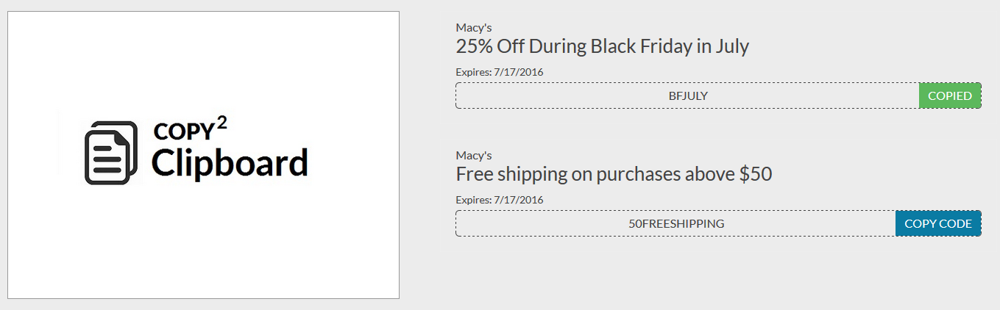

# CopyToClipboard.js


> Modern copy to clipboard. No Flash. Just under 1kb gzipped.



## Why

Copying text to the clipboard shouldn't be hard and it should work the same across all device and browsers.
It shouldn't require dozens of steps to configure and most of all, it shouldn't depend on Flash or any bloated framework.

## Setup or Usage

First, either include the script located on the `dist` folder or load it from [a third-party CDN provider](//cdn.jsdelivr.net/Copy2Clipboard/latest/CopyToClipboard.min.js).

```html
<script src="dist/CopyToClipboard.min.js"></script>
or
<script src="//cdn.jsdelivr.net/Copy2Clipboard/latest/CopyToClipboard.min.js"></script>
```

CopyToClipboard.js works using button & input ids `[pattern] - CpnCode_input_* or CpnCode_btn_*` for instance
```html
<p class="code-container" id="CpnCode_input_50FREESHIPPING" contenteditable="False">50FREESHIPPING</p>
<span class="input-group-btn">
    <button id="CpnCode_btn_50FREESHIPPING" class="btn" type="button" data-clipboard-text="50FREESHIPPING" data-clipboard-target="CpnCode_input_50FREESHIPPING">
        <span class="copy">COPY CODE</span>
    </button>
</span>
```

Now, you need to instantiate it by calling InitializeCopyToClipboardTriggers function and pass button & input ids [`CpnCode`]

```js
CopyToClipboard.Events.InitializeCopyToClipboardTriggers("CpnCode");
```

which uses below code to create a the pattern or update js file to create your own pattern.
```js
var buttonId = idPrefix + "_btn_";
var inputId = idPrefix + "_input_";
```

## Browser Support

This library relies on [JQuery .off](http://api.jquery.com/off/), [.on](http://api.jquery.com/on/) and [execCommand](https://developer.mozilla.org/en-US/docs/Web/API/Document/execCommand) APIs. The second one is supported in the following browsers.
There are two different ways you can copy text using CopyToClipboard.js

1. Using click of a button (which copy's text and change button style).
2. Manual selection and copy (which changes button style).

Events|  |  |  |  |  |  |
|:---:|:---:|:---:|:---:|:---:|:---:|
|1| ✔ | ✔ | ✔ | ✔ | ✔ | ✘ |
|2| ✔ | ✔ | ✔ | ✔ | ✔ | ✔ |

Although copy operations with [execCommand](https://developer.mozilla.org/en-US/docs/Web/API/Document/execCommand) aren't supported on Safari, it gracefully degrades because [Selection](https://developer.mozilla.org/en-US/docs/Web/API/Selection) is supported. That means you can change button to say `Press Command+C to copy` or change it with appropriate text.
